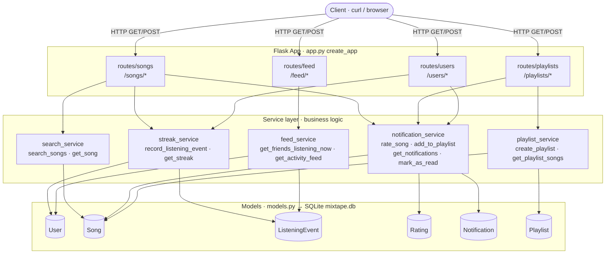
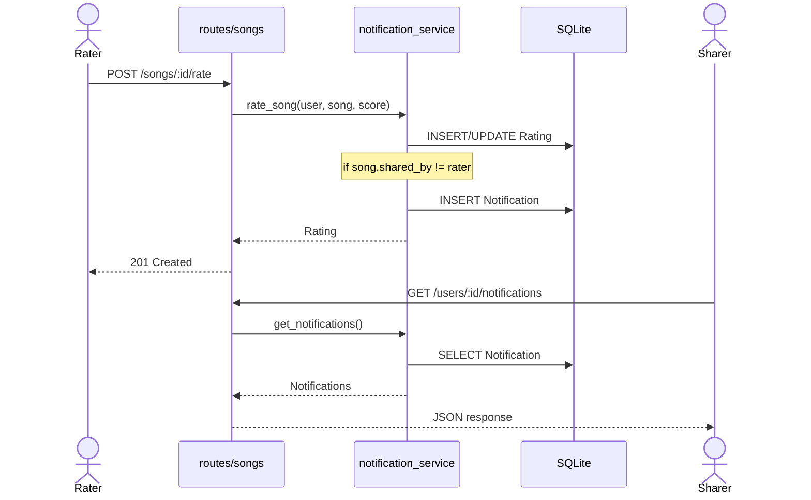
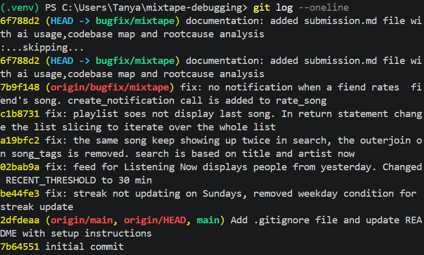

## AI Usage 

I used Claude as a debugging partner throughout.

- **File summary — understanding an unfamiliar module.** I pasted a service file and asked *"What is this module responsible for? What are its main functions and what does each one do?"* This gave me the lay of the land before hunting for any bug, e.g. understanding `notification_service.py` and `feed_service.py`.

- **Data flow trace — Issue 4 (missing rating notification).** I asked the AI to *"trace how a notification gets created when a friend interacts with my song — which functions are called and in what order?"* Tracing the notification path side by side is what exposed that `add_to_playlist` calls `create_notification` but `rate_song` never did — the missing step.

- **Function explanation — Issue 3 (duplicate search results).** I gave the AI the `search_songs` function and asked it to *"walk me through what this does step by step, including what it returns and what could cause an unexpected value."* This is how I learned that the `.outerjoin(song_tags, ...)` produces one row per (song, tag) pair (a join fanout), which is why a multi-tag song appeared twice.

- **Isolating a function in a Python shell — Issue 1 (streak reset).** Instead of firing HTTP requests, I opened a Python REPL, imported `streak_service`, and called `update_listening_streak(user, now)` directly with controlled dates. Passing a Saturday→Sunday pair let me reproduce the Sunday-only reset in seconds and confirm the `today.weekday() != 6` clause was the cause. Faster than the calendar and easier to reason about.

- **Generating curl commands — Issues 2 & 3 (feed and search).** I asked the AI to write the `curl` commands to hit `/songs/search` and `/feed/<id>/listening-now`, including how to fetch a real seeded user ID first, so I could verify each fix end-to-end through the running Flask app.

- **Explaining failing tests — Issue 1 (streak).** I ran `pytest` and asked Claude to explain *why* the failing streak cases were failing, which pointed me back to the weekday condition in `update_listening_streak`.


##Codebase map

```
ai201-project5-mixtape-starter/
├── app.py                      # Flask app factory and DB setup
├── models.py                   # SQLAlchemy models for all entities
├── routes/
│   ├── songs.py                # Song sharing, search, and rating routes
│   ├── playlists.py            # Playlist creation and song management
│   ├── users.py                # User profiles, streaks, notifications
│   └── feed.py                 # Friends listening now, activity feed
├── services/
│   ├── streak_service.py       # Listening streak logic
│   ├── feed_service.py         # Friends listening now feed logic
│   ├── search_service.py       # Song search logic
│   ├── notification_service.py # Notification creation and retrieval
│   └── playlist_service.py     # Playlist retrieval logic
├── tests/
│   ├── test_streaks.py
│   ├── test_search.py
│   └── test_playlists.py
├── seed_data.py                # Populates DB with test data
├── requirements.txt
└── .gitignore
```

## Dataflow



## Rating Notification Flow



## Root Cause Analysis 

### Issue 1: My listening streak keeps resetting 

**How you reproduced it —** I drove `update_listening_streak(user, now)` directly with controlled dates instead of waiting for the calendar. I set a user's `last_listened_at` to a Saturday and then called the function with `now` on the following Sunday. Instead the streak dropped to 1. Repeating the same 1-day-gap test with any *other* pair of days worked correctly — the reset only happened when "today" landed on a Sunday.

**How you found the root cause —** I opened [services/streak_service.py](services/streak_service.py) and read `update_listening_streak`. The logic computes `days_since_last` and branches on it. The moment of certainty was reading the consecutive-day branch: `elif days_since_last == 1 and today.weekday() != 6:`. The `weekday() != 6` clause (6 = Sunday) meant a valid consecutive day was *not* counted whenever today was Sunday, so control fell through to the `else` reset branch.

**The root cause —** The "increment on a 1-day gap" rule carried an extra, incorrect condition that excluded Sundays. On any Sunday, even a perfectly consecutive listen fell through to the `else` branch, which sets `listening_streak = 1`. So every user's streak was silently reset once a week.

**Your fix and side-effect check —** I removed the `and today.weekday() != 6` clause so the branch is simply `elif days_since_last == 1:` — a consecutive day increments regardless of weekday. Afterward I re-checked the other three branches still behave: `days_since_last == 0` (same day → no change), `days_since_last > 1` (skipped day → reset to 1), and `last_listened_at is None` (new user → starts at 1). Ran `tests/test_streaks.py` to confirm.


### Issue 2: Friends Listening Now shows people from yesterday 

**How you reproduced it —** The seed data ([seed_data.py](seed_data.py)) deliberately creates two groups of events: three "recent" ones 10–20 minutes ago (should appear) and eight "older" ones 2+ hours ago (should not). I seeded the DB and called `get_friends_listening_now(nova_id)` / hit `GET /feed/<id>/listening-now`. It returned people who had listened hours earlier — clearly not "now."

**How you found the root cause —** I opened [services/feed_service.py](services/feed_service.py). The query itself looked correct: it filters `ListeningEvent.listened_at >= cutoff` where `cutoff = datetime.now(timezone.utc) - RECENT_THRESHOLD`. So the logic wasn't wrong — I looked *up* at the constant. The moment of certainty was line 13: `RECENT_THRESHOLD = timedelta(hours=24)`.

**The root cause —** "Listening **Now**" is supposed to be a live view, but the recency window was set to 24 hours. Anyone who listened at any point in the previous day — i.e. yesterday — still satisfied `listened_at >= now - 24h` and showed up in the feed.

**Your fix and side-effect check —** I changed `RECENT_THRESHOLD` from `timedelta(hours=24)` to `timedelta(minutes=30)`, matching the "past 30 minutes" intent documented in the seed data. The filter code was left untouched since it was already correct. After the change, `listening-now` returned exactly the 3 recent friends. I also confirmed `get_activity_feed` still returns all 8 events — it is *intentionally* not time-filtered (it caps by count, not recency), so it must not be affected by this constant, and it wasn't.

### Issue 3: The same song keeps showing up twice in search 

**How you reproduced it —** I searched for a term matching a song that has more than one tag (e.g. `GET /songs/search?q=<term>`). The song came back multiple times in the results list. Songs with a single tag appeared once; songs with two tags appeared twice — the duplicate count tracked the number of tags, which was the tell.

**How you found the root cause —** I opened [services/search_service.py](services/search_service.py) and read `search_songs`. The query does `.outerjoin(song_tags, Song.id == song_tags.c.song_id)`. That "duplicates scale with tag count" symptom is the signature of a SQL **join fanout**: joining the many-to-many `song_tags` association produces one row per (song, tag) pair.

**The root cause —** The `outerjoin` against the `song_tags` association table multiplied rows — a song with N tags produced N result rows, so it appeared N times. Worse, the join served no purpose: the `WHERE` clause only matches `title`/`artist` (not tags), and each song's tags are loaded separately by `to_dict()` through the `Song.tags` relationship. The join was pure overhead that only caused duplicates.

**Your fix and side-effect check —** Rather than mask the duplicates with `.distinct()`, I removed the unnecessary `.outerjoin(...)` line entirely (and the now-unused `Tag` / `song_tags` imports). Each matching song now returns exactly once, and tags still populate correctly via the relationship in `to_dict()`. I verified search still matches by both title and artist, and that `get_song` (which never used the join) was unaffected.

### Issue 4: I got notified when a friend added my song to a playlist but not when they rated it

**How you reproduced it —** As a user, I rated a song shared by *another* user (`POST /songs/<id>/rate` with a different `user_id`), then fetched that sharer's notifications (`GET /users/<sharer>/notifications`). No notification appeared. Doing the analogous playlist action (`POST /playlists/<id>/songs`) *did* produce a notification, which confirmed the gap was specific to rating.

**How you found the root cause —** I opened [services/notification_service.py](services/notification_service.py) and read the two interaction functions side by side. `add_to_playlist` ends with a `create_notification(user_id=song.shared_by, ...)` call. `rate_song` saves/updates the `Rating`, commits, and returns — with no `create_notification` anywhere. The certainty came from that direct comparison: the notify step present in one path was simply absent from the other.

**The root cause —** It wasn't a wrong comparison or a bad condition — it was a **missing step**. `rate_song` never created a notification at all. The rating was persisted correctly, but the code that should have told the song's original sharer "someone rated your song" was never written.

**Your fix and side-effect check —** After the rating commits, I added a `create_notification(user_id=song.shared_by, notification_type="song_rated", body="... rated your song '<title>' <score>/5.")` call, guarded by `if song.shared_by != user_id:` so users aren't notified for rating their own song — mirroring the existing guard in `add_to_playlist`. I verified: (a) rating someone else's song now yields a `song_rated` notification for the sharer, (b) rating your own song produces none, and (c) the playlist-add notification path still works unchanged. One open design choice I flagged: it currently notifies on rating *updates* too, not only first-time ratings.

### Issue 5: The last song in a playlist never shows up 

**How you reproduced it —** I added several songs to a playlist and then fetched them with `GET /playlists/<id>/songs`. The response consistently returned one fewer song than I'd added, and the missing one was always the last by position (the most recently added). Adding another song made the previously-missing one appear and hid the new last one — confirming it was always the final element being dropped, not a specific song.

**How you found the root cause —** I opened [services/playlist_service.py](services/playlist_service.py) and read `get_playlist_songs`. The query and its `ORDER BY position` were correct and returned the full set. The bug was in the very last line — the return statement: `return [song.to_dict() for song in songs[:-1]]`. The `[:-1]` slice was the smoking gun: it excludes the final element of the list.

**The root cause —** An off-by-one in the return statement. The list of songs was fetched correctly and in the right order, but the `songs[:-1]` slice chopped off the last element before serializing. So the final song by position was always omitted from the response.

**Your fix and side-effect check —** I changed `songs[:-1]` to `songs[:]` so the full ordered list is returned. Afterward I confirmed all added songs now appear in `position` order, and checked edge cases: a single-song playlist now returns that 1 song (previously it returned an empty list), and an empty playlist still returns `[]`.

##Commits for the Bugs


